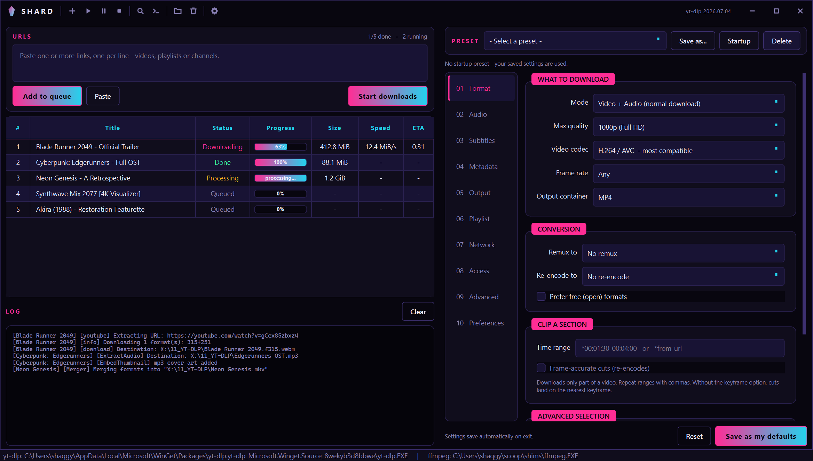
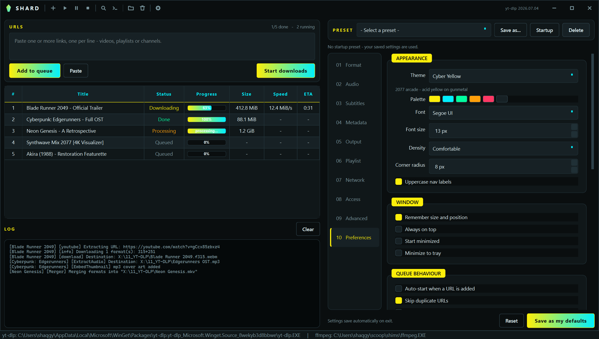
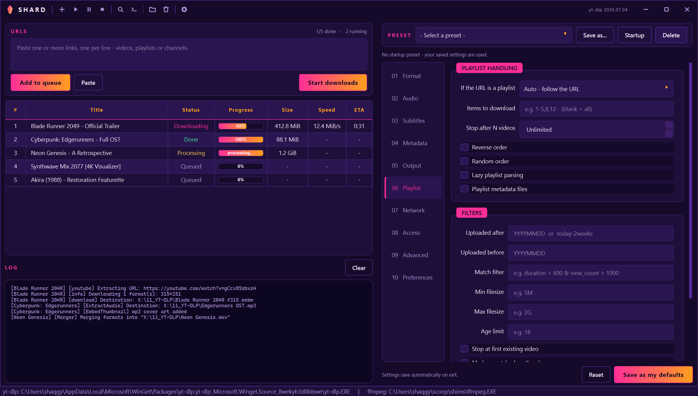

<div align="center">

# Shard

**A neon GUI for [yt-dlp](https://github.com/yt-dlp/yt-dlp).**
Every option exposed, a real download queue, seven themes.

[](LICENSE)
[](https://www.python.org/)
[](https://pypi.org/project/PySide6/)
[](#)



</div>

---

## What it is

yt-dlp is superb and has roughly three hundred command-line options. Shard puts
all of them behind a UI you can actually navigate, without hiding the command it
builds — there is a **Preview command** button that shows the exact invocation,
so you never lose the ability to reason about what is happening.

Shard does not reimplement downloading. It builds a command line and runs
yt-dlp as a subprocess. See [NOTICE.md](NOTICE.md).

> Shard is an independent project and is **not** affiliated with or endorsed by
> the yt-dlp project.

## Features

- **Full option surface** — ten sections covering format selection, audio
  extraction, subtitles, metadata, SponsorBlock, playlists, networking,
  cookies/auth, and raw flag passthrough
- **Download queue** — concurrent downloads, per-row progress, speed and ETA,
  pause/resume, retry, drag-and-drop links
- **Clip a time range** — grab 2:00–5:00 of a video with `--download-sections`
- **Livestream capture** — from the start, or wait for a scheduled stream
- **Presets** — six built in (MP3 320k, 1080p H.264, 4K MKV, FLAC, archive…),
  save your own, mark one to load at startup
- **Format explorer** — probe a URL and pick an exact stream ID from a table
- **Seven themes** — switch live, no restart; every icon is drawn at runtime and
  recolours with the palette
- **Clipboard watching** — copy a link, it queues itself (opt-in, links only)
- **Portable build** — one self-contained `.exe`, no Python needed

<details>
<summary>More screenshots</summary>

**Preferences — Cyber Yellow theme**


**Output section — Synthwave theme**


</details>

## Install

### Portable executable

Grab `Shard.exe` from [Releases](../../releases). No installation, no Python.

### From source

```bash
git clone https://github.com/Shaqgy1/shard-dl.git
cd shard-dl
pip install -r requirements.txt
python main.py
```

### Requirements

| | |
|---|---|
| **Python** | 3.11+ (only when running from source) |
| **yt-dlp** | `winget install yt-dlp.yt-dlp` — bundled in the exe as a fallback |
| **ffmpeg** | `winget install Gyan.FFmpeg` — required for merging and audio conversion |

Shard finds yt-dlp on `PATH`, in the usual winget locations, or next to its own
executable. An installed copy always wins over the bundled one, so updates keep
taking effect.

## The window

Frameless, with an Obsidian-style 40px title bar carrying the app's actions —
no separate header or toolbar eating vertical space.

```
◆ SHARD │ ＋ ▶ ‖ ■ │ ⌕ >_ │ 🗀 🗑 │ ⚙        yt-dlp 2026.07.04   ─ ▢ ✕
```

Drag the bar to move, double-click to maximize, drag any edge to resize — all
delegated to the OS, so Windows snap layouts work normally.

### Keyboard

| Shortcut | Action |
|---|---|
| `Ctrl+Enter` | Add the URLs to the queue |
| `Ctrl+D` | Start downloading |
| `Ctrl+L` | Focus the URL box |
| `Ctrl+I` | Inspect formats |
| `Ctrl+K` | Preview the command |
| `Ctrl+O` | Open the download folder |
| `Ctrl+,` | Preferences |
| `Delete` | Remove the selected rows |
| `Ctrl+Q` | Quit |

## Themes

| Theme | Look |
|---|---|
| **Neon Crystal** *(default)* | Magenta and cyan shards on deep violet-black |
| **Cyber Yellow** | 2077 arcade — acid yellow on gunmetal |
| **Synthwave** | Sunset grid — hot pink over deep purple |
| **Matrix** | Phosphor green on black |
| **Tokyo Night** | Soft neon, the calm one |
| **Deep Freeze** | Ice blue and electric cyan |
| **Blood Moon** | Crimson on slate |

Font, size, density, corner radius and label casing are adjustable too.

## Section map

| # | Section | Covers |
|---|---|---|
| 01 | Format | mode, resolution cap, video codec, fps cap, container, remux/re-encode, clip a time range, multistreams, raw `-f` and `-S` |
| 02 | Audio | extraction format, VBR/CBR quality, preferred audio codec, keep-video |
| 03 | Subtitles | download, auto-generated, embed, languages, format, conversion |
| 04 | Metadata | thumbnails, chapters, sidecar files, SponsorBlock, chapter removal, metadata parse/replace |
| 05 | Output | folders, filename templates, overwrite policy, download archive, run-command-after |
| 06 | Playlist | playlist vs single, item ranges, ordering, date/size/age filters, livestreams |
| 07 | Network | speed limit, parallel fragments, chunk/buffer size, retries, proxy, TLS, HLS, aria2c |
| 08 | Access | cookies from browser or file, site login, headers, geo-bypass |
| 09 | Advanced | ffmpeg path, post-processor args, extractor args, cache, verbosity, raw flags |
| 10 | Preferences | appearance, window, queue behaviour, integration, logging, binaries |

## Configuration

Settings live in `%APPDATA%\Shard\settings.json`, with export/import in
Preferences. Passwords and 2FA codes are held **in memory for the session only**
and are never written to disk.

Shard passes `--ignore-config` by default and sets every path explicitly, so
nothing in `%APPDATA%\yt-dlp\config` can silently override the GUI. You can turn
that off in Advanced.

Two behaviours are deliberately opt-in and off by default:

- **Clipboard watching** reacts only to `http(s)` links, never to other content.
- **Shut down when done** schedules a shutdown with a 60-second window;
  `shutdown /a` cancels it.

## Building the executable

```bash
pip install -r requirements-dev.txt
python -m PyInstaller build.spec --noconfirm
```

Produces `dist\Shard.exe` (~55 MB, single file). The spec bundles a copy of
`yt-dlp.exe` as a fallback and drops ~30 unused Qt modules to keep startup fast.

Regenerate the icon after editing `tools/make_icon.py`:

```bash
python tools/make_icon.py
```

## Project layout

```
main.py              launcher
build.spec           PyInstaller spec
shard/
  config.py          Options + AppPrefs dataclasses, persistence, presets
  ytdlp.py           binary discovery, format selector, argument builder
  worker.py          QProcess download jobs, progress parsing, queue manager
  theme.py           palettes and stylesheet generation
  icons.py           runtime-drawn vector icons
  titlebar.py        frameless chrome, resize grips
  options_panel.py   the ten option sections
  dialogs.py         format explorer, command preview
  main_window.py     window, queue table, log
tools/make_icon.py   generates assets/icon.ico
```

## Contributing

Bug reports and pull requests are welcome — see [CONTRIBUTING.md](CONTRIBUTING.md).

## License

[MIT](LICENSE) © 2026 Shaqgy.

Built on yt-dlp (Unlicense) and Qt/PySide6 (LGPL v3). Read
[NOTICE.md](NOTICE.md) before redistributing the packaged executable — embedding
Qt in a single-file binary carries LGPL obligations.

Shard is a tool. It does not host or index any media, and what you download with
it is your responsibility.
